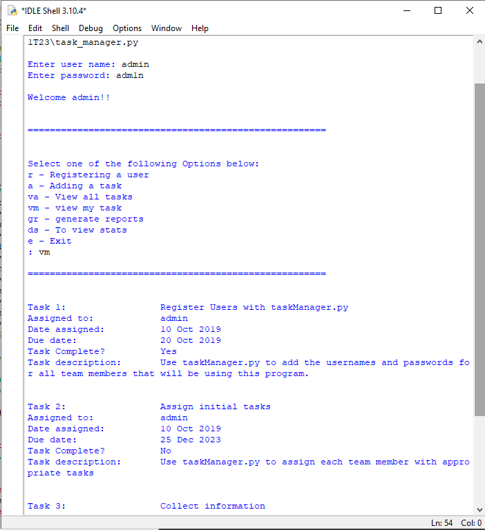
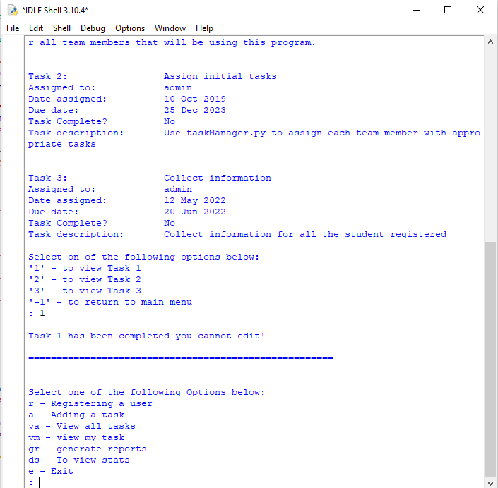
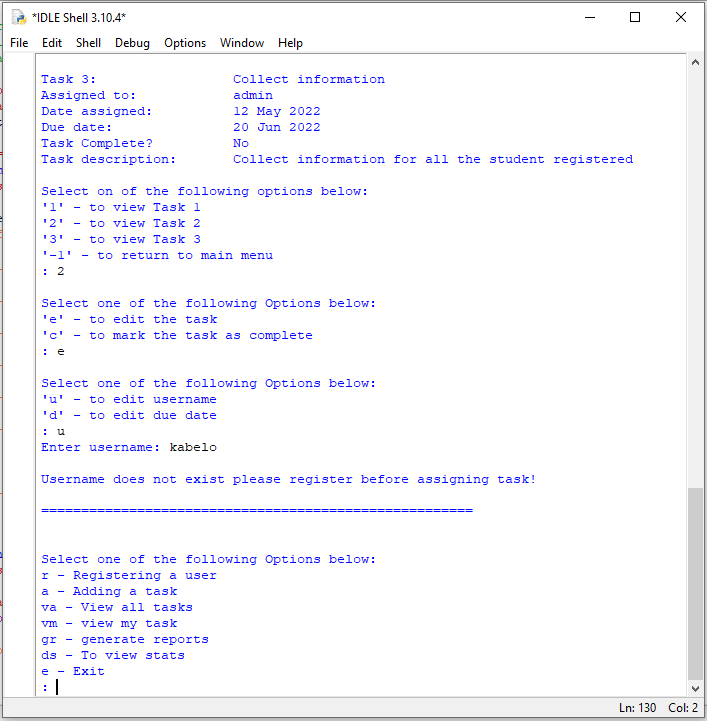
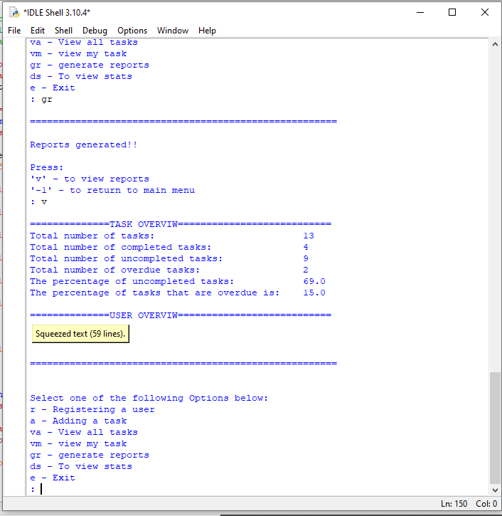

# TASK MANAGER v2
This program helps small business to manage tasks assigned to each member of the team.
## TABLE OF CONTENT
* [General Info](#general-information)
* [Technologies Used](#technologies-used)
* [Features](#features)
* [Screenshots](#screenshots)
* [Setup](#setup)
* [Usage](#usage)
* [Project Status](#project-status)
* [Room for Improvement](#room-for-improvement)
* [Acknowledgements](#acknowledgements)
* [Contact](#contacts)
## GENERAL INFORMATION
The program with works two text files, user.txt and tasks.txt. It stores a list of all the tasks that the team is working on in tasks.txt file. user.txt stores the username
and password for each user that has permission to use the program
## TECHNOLOGIES USED
* Python IDLE 3.10
* Notepad++
## FEATURES
* Stores the user's login information
* You can register as many users as possible
* Only admin can register new users
* Assigns task to users and stores them
* Update tasks when completed
* Update tasks details like completion date, person assign to etc
* View all the tasks stored in tasks.txt
* View only tasks assigned to a specific user
* View statics 
* Generate task reports
## SCREENSHOTS
  

## SETUP
Download a program to a folder of your choice. Also download the text files on the same folder before you run the program. Use one of the following technologies to run the program.
This program can executed using:
* Python IDLE 
* VS code
* or any python compatible IDE
## USAGE
Once all the files have been downloaded on to the single folder follow the steps below to run you program
1. Diploy/execute the program
2. The program will ask you to enter username and password. Use **admin** as username and **adm1n** as password
3. You will then have access to all the obtions and you can register new users
4. Only admin can register new users 
5. Admin has access to more obtion
6. Only admin can generate reports and view stats
## PROJECT STATUS
* Completed
## ROOM FOR IMPROVEMENT
* Follow more OOP style of programing
## ACKNOWLEDGEMENTS
This project was inspired by HyperionDev
It was based on Capstone Project 2 Level 1 Task 23
Many thanks to Ikenna Tshabalala for reviewing code
## CONTACTS
Created by mfanafuthis@hotmail.com
Cell no: 0735603009
